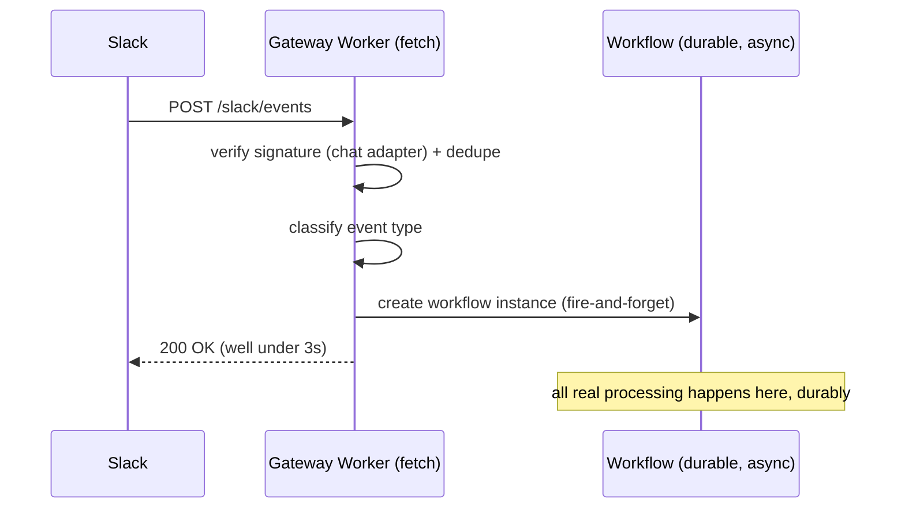
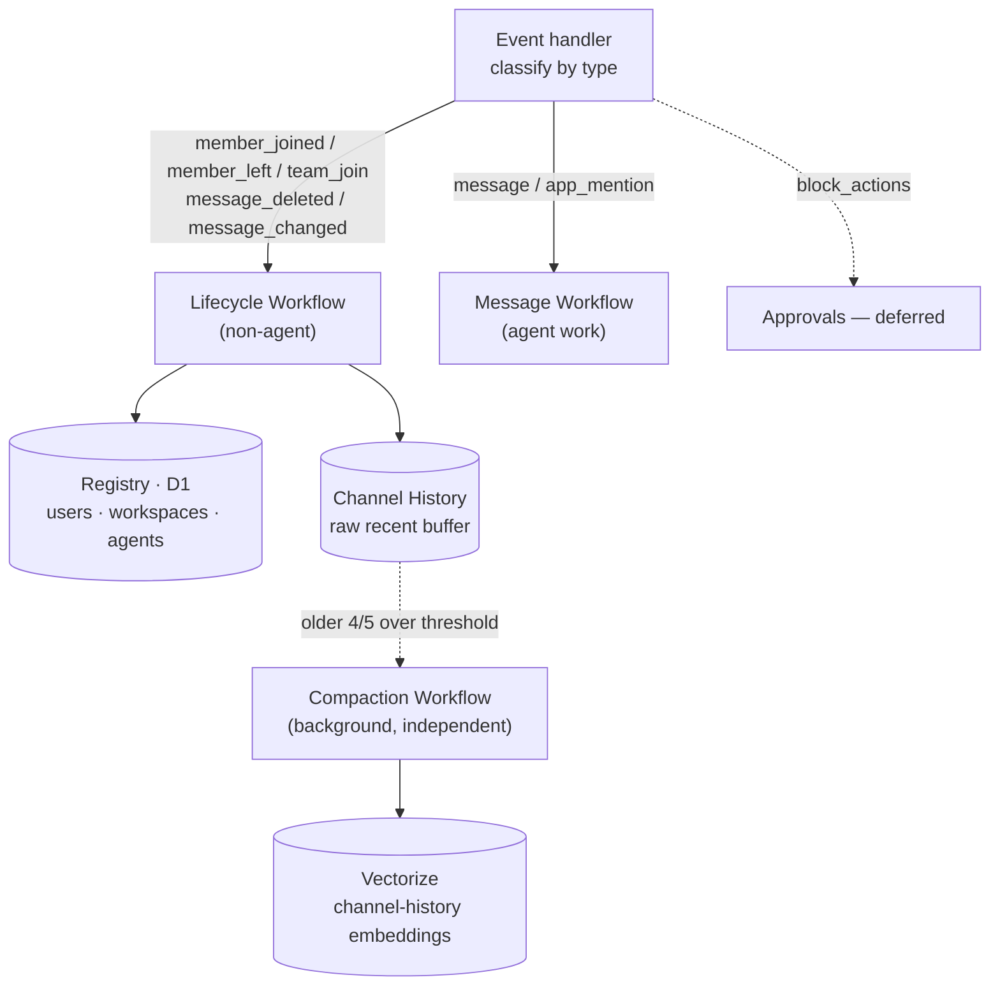
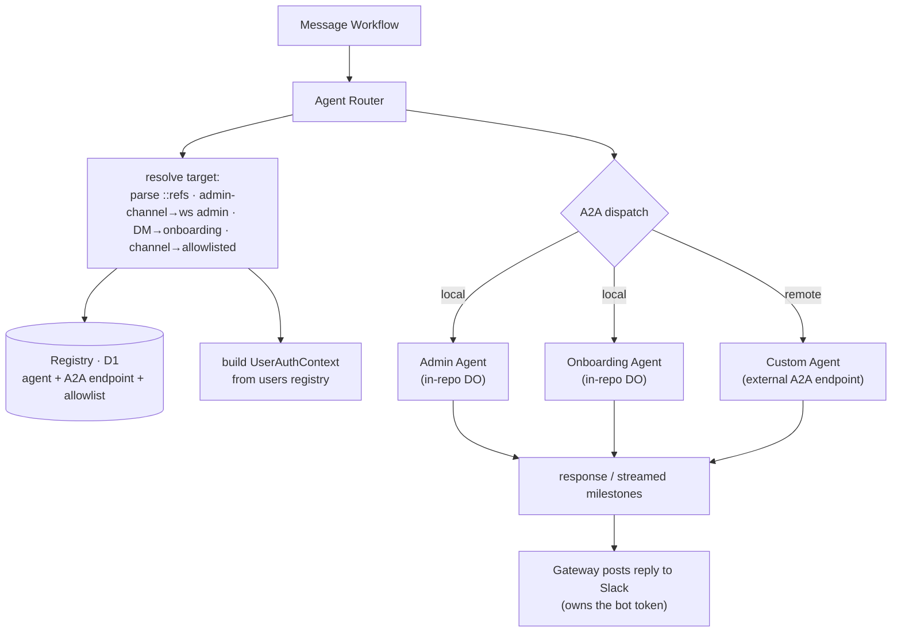
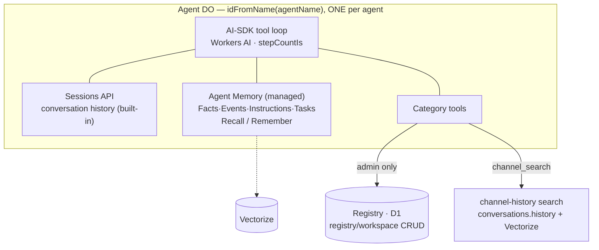
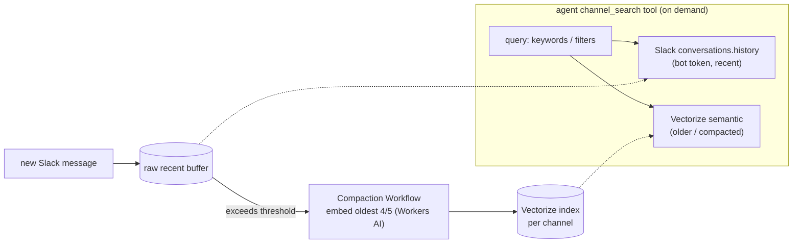

# PLAN.md — Migrating the Looping Control Plane onto looping-gateway

> Status: **high-level draft (v2)**. This session establishes the map, the
> stack-gap analysis, and the key decisions. Deeper per-subsystem design happens
> in later sessions, reusing this file.

## Context

The original [looping-control-plane](https://github.com/Looping-AI/looping-control-plane)
is a **Motoko / Internet Computer** system: two canisters (`control-plane-core`
~640 KB of source, plus a dynamically-spawned `internal-engine` ~100 KB) that
turn Slack into the UX layer for a multi-agent platform — agent registry, `::`
routing, sessions/turns/traces, workspace+admin model, encrypted secrets,
workflow execution, and a human-in-the-loop approval gate.

**looping-gateway** (this repo) is a **TypeScript / Cloudflare Workers** project
built on the Agents SDK (Durable Objects), the `chat` + `@chat-adapter/slack`
SDK, and Workers AI. Today it is a single `SlackAgent` DO that answers mentions
and DMs with a small Workers-AI tool loop.

We want to bring the **control plane + admin agent + onboarding agent** onto this
stack — but **improve and simplify on the move, not port faithfully**. This is a
re-implementation across two very different platforms. Much of the original's
complexity is ICP-workaround machinery that the Cloudflare SDKs already provide;
a faithful port would re-import accidental complexity.

### What actually exists in the original (don't over-estimate scope)

- **Admin agent** — fully implemented: an OpenRouter multi-round tool loop
  (`admin-agent-loop.mo`, ~300 lines) with web search, secrets management, and
  `dispatch_workflow` (handoff to the internal engine), plus approval handling.
- **Onboarding agent** — **stub only** (`"category service not yet implemented"`).
  → Effectively green-field; we design it fresh for Cloudflare.
- **Custom agent** — stub only. In the target it is **remote** (outside this repo).
- **Control plane core** — the real bulk: Slack adapter, event store + router +
  per-event timer dispatch, message handler, agent registry, sessions/turns/
  traces, workspace/slack-user models, secrets + encryption, timers, workflow
  envelope/catalog/approval subsystems, OpenRouter + Slack wrappers.

## Source → Cloudflare mapping (the core of the migration)

| Original (ICP / Motoko)                                                          | Cloudflare target                                                     | Migrate / Simplify / Drop          |
| -------------------------------------------------------------------------------- | --------------------------------------------------------------------- | ---------------------------------- |
| `control-plane-core` canister                                                    | Gateway Worker + Workflows + Registry (D1) + per-agent DOs            | Re-implement                       |
| `internal-engine` canister (dynamic spawn)                                       | inline AI-SDK tool loop inside each agent DO                          | **Simplify**                       |
| event store + router + per-event timer dispatch                                  | event handler classify → **Cloudflare Workflows**                     | **Re-shape**                       |
| `events/handlers/*` (message, member-joined/left, team-join, msg-deleted/edited) | Lifecycle Workflow (non-agent) + Message Workflow (agent)             | Re-implement                       |
| `agent-runner` + admin loop + OpenRouter wrapper                                 | per-agent AI-SDK loop (Workers AI) reached via **A2A**                | Re-implement                       |
| sessions / turns / traces (bespoke)                                              | **Agents SDK Sessions API + context blocks** (writable SQLite memory) | **Drop our impl; use platform**    |
| channel-history-model (bespoke timeline)                                         | per-agent **episodic recall**: compacted-away msgs → **Vectorize**    | **Re-shaped** (recall, not search) |
| Stable memory / canister `var`s                                                  | D1 (global registry) + per-agent DO SQLite                            | Re-implement                       |
| `slack-adapter.mo` HMAC + normalize (39 KB)                                      | `@chat-adapter/slack`                                                 | **Drop** (SDK does it)             |
| `slack-wrapper.mo` (users.list, conversations.\*)                                | thin Slack Web API client for reads the chat SDK doesn't cover        | Partial migrate                    |
| Timers (`Timer.setTimer`, `recurringTimer`)                                      | Workflows + Agents SDK `this.schedule()` / cron                       | Re-implement (smaller)             |
| Threshold-Schnorr secret encryption + key cache                                  | Cloudflare Secrets Store, or WebCrypto AES-GCM                        | **Deferred**                       |
| `http-certification.mo`, `httpCertStore`                                         | n/a (ICP query-certification concept)                                 | **Drop**                           |
| workflow envelope / nonce / scope grants / catalog hash                          | n/a (single-process tool authz; no cross-canister trust boundary)     | **Drop**                           |
| Approval gate (Block Kit + `ApprovalTimer`)                                      | Agents SDK Workflows human-in-the-loop (later)                        | **Deferred**                       |
| Agent registry + `::` routing                                                    | D1 tables + Agent Router inside the Message Workflow                  | Migrate                            |
| Workspace + admin-channel model                                                  | D1 + Slack channel membership                                         | Migrate                            |

## Resolved decisions

1. **LLM provider — Workers AI** via `workers-ai-provider` + the AI SDK (`ai`).
   Isolate the model/provider behind one module so it stays swappable. (Workers
   AI has no built-in web search; `web_search` deferred / optional MCP later.)
2. **Ambition — MVP-first, Cloudflare-native.** Reuse platform primitives instead
   of porting bespoke subsystems.
3. **Execution — single in-DO AI-SDK tool loop** (`generateText` + tools +
   `stepCountIs`). No internal-engine, no envelopes/nonces/scope-grants.
4. **Async by default — never process inline.** Gateway acks Slack `200` in ms,
   then a **Cloudflare Workflow** does the work durably.
5. **Agents reached over A2A.** Local (Admin/Onboarding) and remote (Custom)
   agents are dispatched the same way.
6. **Session/memory is platform-managed.** Use the Agents SDK **Sessions API +
   context blocks** (`agents/experimental/memory/session`): managed conversation
   history + compaction, a read-only `"soul"` identity block, and a **writable
   SQLite `"memory"` scratchpad** the model self-edits via `set_context`. We do
   **not** build session/turn/trace tables. There is **no** managed
   Facts/Recall/Vectorize layer — long-term semantic recall was dropped; the
   writable memory block is the model. Mental model: a **virtual co-worker**.

### Platform primitives we lean on (don't rebuild)

- **Cloudflare Workflows** — durable, retriable async; trigger an instance from
  the Worker and return immediately.
- **A2A protocol** — uniform agent dispatch via the **official `@a2a-js/sdk`**
  (the `agents` SDK ships no A2A surface). Local agents are reached in-process
  over their DO `stub.fetch` (the client's `fetchImpl` is bound to the stub);
  remote/custom agents use the same client over real HTTP. See Phase 3 below.
- **Agents SDK Sessions API + context blocks** — per-agent conversation history +
  compaction, plus context blocks injected into the system prompt (read-only
  `"soul"`, writable SQLite `"memory"`). Managed: storage, prompt assembly,
  compaction, token accounting. (No managed Facts/Recall/Vectorize layer.)
- **Vectorize + Workers AI embeddings** — channel-history compaction index.
- **D1** — global relational registry (workspaces / users / agents).

---

## Target architecture (Cloudflare)

**Guiding principle:** the Gateway never runs agent work inline. It verifies the
Slack request, classifies the event, **kicks off a Workflow, and returns `200`
within milliseconds** (Slack's 3s ack budget). Lifecycle bookkeeping, routing,
and agent execution all happen asynchronously and durably inside Workflows.

### A) Ingress — ack Slack in milliseconds

### B) Event handler → workflow categories

### C) Message Workflow — router + A2A dispatch

### D) Inside an agent — a "virtual co-worker"

> Session/memory is per-**agent**, independent of which user or channel triggered
> the message — the same agent keeps one evolving memory.

### E) Channel history — recent-raw + compacted-embedded

- Agents are **never** handed the full raw channel history in context. They pull
  what they need via the `channel_search` tool; older history lives as embeddings.
- Compaction runs in its **own** Workflow so it never blocks the AI request path.
- **No Slack user token**: recent history via bot-token `conversations.history`,
  older history via our Vectorize index. (`search.messages` deliberately avoided —
  it would require a user token + broader scope.)

### Component ownership

| Component                                  | Where it lives                                               |
| ------------------------------------------ | ------------------------------------------------------------ |
| Gateway `fetch` + event handler            | this repo (Worker)                                           |
| Lifecycle / Message / Compaction Workflows | this repo (Cloudflare Workflows)                             |
| Registry (workspaces / users / agents)     | D1                                                           |
| Admin + Onboarding agents                  | this repo (per-agent DOs, A2A servers)                       |
| Custom agents                              | **remote**, outside this repo (A2A)                          |
| Sessions + context-block memory            | per-agent DO SQLite (Agents SDK Sessions)                    |
| Episodic-recall index                      | per-agent Vectorize namespace, written at Session compaction |

### Authorization (kept from original — permissions inherit here)

- Users registry: `{ slackUserId, displayName, isPrimaryOwner, isOrgAdmin, adminWorkspaces }`.
- `UserAuthContext` with OR-semantics `IsPrimaryOwner | IsOrgAdmin | IsWorkspaceAdmin(wsId)`,
  derived purely from Slack channel membership; built in the Message Workflow and
  passed to the agent over A2A.
- Multi-workspace: `WorkspaceRecord = { id, name, adminChannelId }`; workspace 0 = org.

### Agent→agent delegation (recommendation)

Keep the original's **Slack re-entry** model for auditability: an agent that needs
another posts `::other` to Slack, which re-enters as a new event → new Message
Workflow → A2A to that agent. (Direct A2A delegation is possible but bypasses the
audit/round-limit trail — revisit later.)

---

## Deferred (revisit when requirements firm up)

- Secrets + encryption (and the secrets admin tools) — requirements unclear yet.
- Approval gate — reintroduce via Agents SDK Workflows human-in-the-loop when a
  destructive tool (e.g. `workspace_delete`) is exposed to non-owners.
- `web_search` tool, `session_update_policy` tool.
- GitHub `#github` runtime agents; Store / skills; auth tokens; cost/budgeting.

## Dropped (ICP-specific or accidental complexity — do not migrate)

- Two-canister split + internal-engine; envelope/nonce/scope-grant/catalog-hash.
- HTTP certification; threshold-Schnorr key derivation; cycles / engine-topup;
  `postupgrade` migration code.
- Bespoke event store + per-event timer dispatch + `slack_queue_*` ops →
  replaced by Workflows + Workers observability.
- Bespoke session/turn/trace tables → Agents SDK Sessions + Agent Memory.
- Bespoke Slack HMAC verification + event normalization → `@chat-adapter/slack`.

## Phased plan (each ≈ one PR)

1. **Ingress + Workflows skeleton** — Worker `fetch` verifies via chat adapter,
   classifies events, triggers a Workflow, returns 200. Stub Lifecycle + Message
   Workflows. (Replaces the inline `SlackAgent.onRequest` path in [src/server.ts](src/server.ts).)
2. **Registry (D1) + users/workspaces + Lifecycle Workflow** — schema
   (`workspaces`, `slack_users`, `workspace_admins`, `agents`, `agent_channels`);
   membership/team-join handlers + a scheduled reconciliation; `UserAuthContext`
   builder + `authorize()`; org/workspace bootstrap.
3. **Message Workflow + Agent Router + A2A** — ✅ done. Router (`src/router/`)
   resolves the target (`::name` / admin-channel / DM / allowlist), the Workflow
   builds the auth context, dispatches over A2A (`@a2a-js/sdk`) to the agent DO,
   and posts the reply (`chat.postMessage`). Agents are **plain Durable Objects**
   that serve A2A via a small `fetch` bridge (`src/a2a/serve.ts`) over the SDK's
   `DefaultRequestHandler`; Phase-3 behavior is an `EchoExecutor` placeholder.
   They can later `extend Agent` (same class name + SQLite) with no migration.
4. **Admin agent (in-repo, A2A server)** — ✅ done. Replaced `AdminAgent`'s
   `EchoExecutor` with a Workers-AI tool loop (`src/agents/admin/`). **One DO
   instance per workspace** (`admin:{wsId}` — `admin:0` = org), each with its own
   SQLite, so Sessions (conversation history + compaction) and a writable
   `"memory"` context block evolve in isolation. Tools are consolidated to
   read/write per domain (no proliferation): `agents_read` / `agents_write`
   (register / update — incl. channel attach/detach — / unregister) and
   `workspace_read` / `workspace_write` (create / set_admin_channel; **no
   delete**). Capability is **instance-scoped**: `workspace_write` is only built
   on `admin:0`; per-call `authorize()` (auth context on `message.metadata`) is
   defense-in-depth. Provider isolated in `src/agents/model.ts`. (Vectorize semantic
   recall dropped — the writable SQLite memory block is the memory model.)
5. **Onboarding (DM) agent (in-repo, A2A server)** — ✅ done. Replaced
   `OnboardingAgent`'s `EchoExecutor` with a Workers-AI concierge loop
   (`src/agents/onboarding/`). **One DO instance per user**
   (`onboarding:{slackUserId}` — keyed off `DispatchMetadata.slackUserId`), each
   with isolated Sessions + a writable `"memory"` block about that user. The
   agent is **read-only** and serves everyone: a single consolidated
   `directory_read` tool (operations `agents` / `workspaces` / `health`,
   self-scoped to the caller's `UserAuthContext`) that explains the system,
   **routes by words** (no A2A handoff — keeps Slack re-entry), and surfaces
   health computed live from the registry (reconcile results aren't persisted).
   The generic turn loop, Session factory, message glue, and `callerContext` were
   extracted to `src/agents/shared/` and the Phase-4 admin agent refactored to
   reuse them.
6. **Episodic recall — Vectorize, fed at compaction** — ✅ done. _Replaces the
   original channel-history / `channel_search` idea._ That was rejected: Slack's AI
   Search (`assistant.search.context`) is AI-plan-gated, can surface channels the
   agent isn't authorized to see, and needs an extra `action_token`; raw
   `conversations.history` is pagination, not semantic search. Instead, when an
   agent's Session compacts (`compactAfter(60_000)` tokens — rare, often weeks
   apart) the raw messages it displaces are embedded (Workers AI
   `@cf/baai/bge-m3` — multilingual, 1024-d) and upserted into **Vectorize**, partitioned per
   agent instance by `namespace` (`admin:{wsId}` / `onboarding:{userId}`). A single
   gated `recall` tool semantically searches them — built only once the instance has
   compacted ≥1 time (before that everything is still in live history). Sourcing
   **only** from the agent's own compacted history makes recall permission-safe by
   construction. New `src/agents/shared/recall.ts` + `recall-tool.ts`; archival is
   hooked via `archivingCompaction` in `src/agents/shared/session.ts`; both executors
   wired. **Cloudflare AI Search (AutoRAG)** is reserved for a future knowledge-base
   corpus, not this.
7. **Remote/custom A2A agents** ✅ done. Register external A2A endpoints and route to them
   over real HTTP — **zero-trust, no shared secrets**; all trust flows through asymmetric
   Ed25519 (EdDSA) signatures over public JWKS.
   - **Gateway identity (B authenticates A).** The gateway holds an Ed25519 private JWK
     (`GATEWAY_JWT_PRIVATE_KEY` secret; `kid` for rotation) and publishes only the public
     half at `GET /.well-known/jwks.json` (`src/auth/agent-jwt.ts` → `getPublicJwks`,
     wired in `src/server.ts`). Each remote dispatch mints a short-lived (120 s) signed JWT
     (`signGatewayToken`) with `iss = GATEWAY_ISSUER`, `aud = originOf(endpoint)`,
     `sub`/`iat`/`exp`/`jti`, and a **minimal** identity under the namespaced
     `https://looping.ai/identity` claim (`slackUserId`, `displayName`, `workspaceId`,
     `agentKind`). The full `UserAuthContext` — and any permission flags — **never** cross
     the trust boundary; remote `message.metadata` carries only per-kind routing extras
     (`src/agents/dispatch.ts`).
   - **Agent identity / TOFU pin (A knows B is really B).** At registration the gateway
     fetches the remote's **signed AgentCard** (A2A §8.4, RFC 7515 detached EdDSA flattened
     JWS over the card's canonical JSON), verifies it, and **pins** the signing key's
     `kid` + `jku` in the registry (`agents.card_signing_jku` / `card_signing_kid`,
     migration `0006`). Re-pointing an agent re-verifies and must keep the **same** pinned
     identity (a different signer is rejected) — the same Trust-On-First-Use anchor pattern
     as the Slack `team_id`. `src/a2a/card-verify.ts`; injected into admin tools via
     `AdminToolDeps.verifyEndpoint` so the pure handlers stay offline-testable.
   - **Canonical JSON contract.** Card signing/verification is over a deterministic
     serialization: object keys sorted recursively, `JSON.stringify` with no whitespace,
     `signatures` excluded, UTF-8 → base64url. The gateway verifier and the `example/`
     signer share this byte-for-byte (`src/a2a/card-verify.ts` ↔ `example/src/canonical.ts`).
   - **SSRF defense.** Remote endpoints (and `jku`s) are HTTPS-only and rejected if they
     resolve to loopback / private / link-local / CGNAT / metadata IPv4+IPv6, bare
     single-label hosts, or `.local`/`.internal`/`.localhost`; an optional operator
     allowlist (`REMOTE_AGENT_ALLOWED_HOSTS`) overrides with exact-host matching
     (`src/a2a/endpoint.ts`). Residual DNS-rebinding risk is documented; the allowlist is
     the mitigation.
   - **Untrusted-reply hardening.** Remote calls run with a 30 s timeout and the reply is
     control-char-stripped + length-capped (16 k) before reaching Slack (`src/a2a/client.ts`).
   - **Reference worker.** `example/` is a complete, deployable custom agent that signs its
     own card, publishes its card-signing JWKS, **verifies the gateway JWT** (`iss`/`aud`/`exp`
     against the gateway's public JWKS), and echoes the caller — the external contract,
     documented in `example/README.md`.
   - **Deferred / future.** Async, scope-based capability permissions on a Gateway API
     (remote agents calling _back_ into the gateway — e.g. a recall-like read with the
     caller's scoped consent) are out of scope here; Cloudflare Access / a reverse-direction
     JWT are the likely building blocks.
8. **Slack team-id hardening** ✅ done. `team_id` is a global invariant: `workspaces.slack_team_id`
   and `slack_users.slack_team_id` removed (both were wrong modelling). A new `workspace_configs`
   (workspace_id + key PK, value NOT NULL) table with `SystemConfigKeys.SLACK_TEAM_ID = "slack_team_id"`
   stores the anchor on ws0. Reconcile pins it **Trust-On-First-Use** (first `auth.test` call; write-once
   — mismatch is logged loudly but the anchor is never overwritten). `handleSlackEvent` reads the anchor
   from D1 on isolate cold-start (memoised after), and returns 400 + error-logs any event whose `team_id`
   differs from the pinned value. Bootstrap grace window: no anchor yet → skip check. No team_id in
   event → skip check (Q6). Only `/slack/events` is affected; internal workflows, cron, and agents are
   untouched. No new binding, no operator config, no secrets involved.

## Verification

- **Unit (Vitest + `@cloudflare/vitest-pool-workers`)**: event classification,
  router target resolution, `authorize()` truth table, registry CRUD,
  reconciliation diffing. Reuse the original's Slack payload fixtures
  (`tests/stubs/slack-payloads/*.json` in the source repo).
- **Workflow/integration**: assert 200 returns before processing; exercise
  Lifecycle + Message Workflows with stubbed Slack/A2A; confirm per-agent memory
  isolation.
- **End-to-end**: `wrangler dev` + tunnel (README Option A/B), install to a test
  Slack workspace; verify admin commands in an admin channel and the concierge in
  a DM; check Workers observability traces.
- `npm run check` (prettier + eslint + tsc) green before each PR.

## Decisions locked this session

- **Registry storage → D1** (relational; queried directly by Workflows; no
  single-DO serialization bottleneck).
- **Slack I/O → Gateway/Workflow owns it** (bot token stays central; agents
  return results over A2A; works uniformly for local and remote agents).
- **`channel_search` → Vectorize + bot-token `conversations.history`** (no Slack
  user token; `search.messages` avoided).

## Notes for later sessions

- ~~Confirm exact Agents SDK Sessions/Agent Memory bindings + Vectorize wiring.~~
  Resolved (Phase 4): Sessions API (`agents/experimental/memory/session`, **experimental**)
  - context blocks; agents `extend Agent` for `this.sql`. No Vectorize for admin memory.
- A2A contract: `UserAuthContext` is carried on `message.metadata` (trusted for **local**
  same-worker dispatch). ~~Still open: authenticating `metadata` for remote agents (Phase 7).~~
  Resolved (Phase 7): remote dispatch carries a short-lived **signed gateway JWT** (EdDSA,
  verified against the gateway's public JWKS) with a minimal scoped identity claim — never
  the full context — and the remote's signed AgentCard is verified + key-pinned (TOFU) at
  registration. Still open: streaming milestones / task lifecycle for remote agents.
- Decide secrets model (Secrets Store vs WebCrypto AES-GCM) when requirements firm up.
