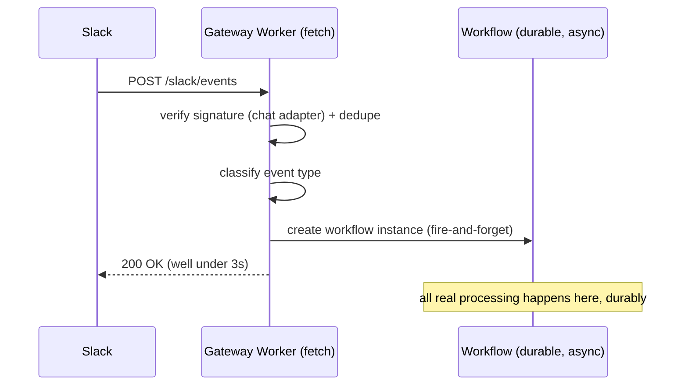
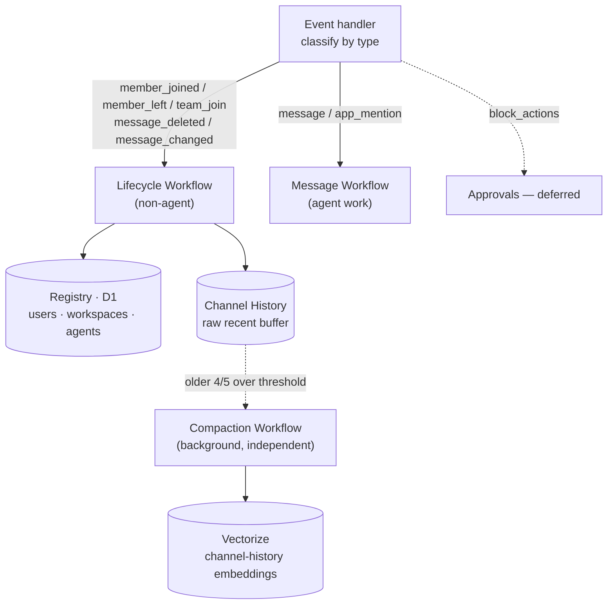
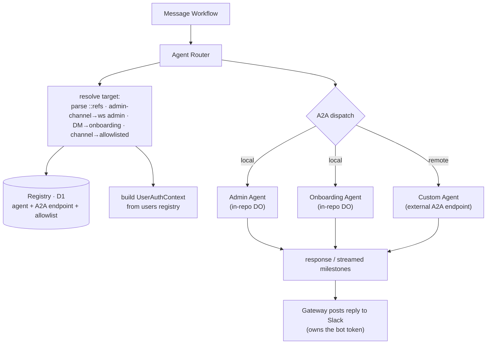
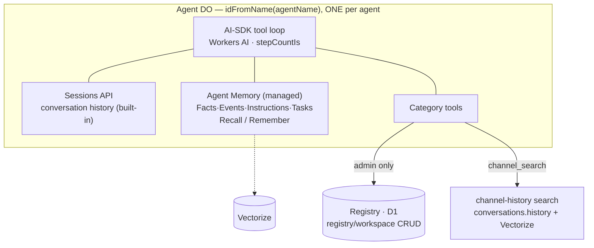
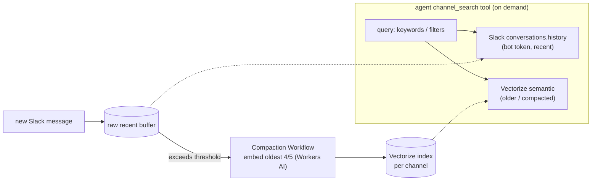

# PLAN.md — Migrating the Looping Control Plane onto looping-gateway

> Status: **high-level draft (v2)**. This session establishes the map, the
> stack-gap analysis, and the key decisions. Deeper per-subsystem design happens
> in later sessions, reusing this file.

## Context

The original [looping-control-plane](https://github.com/Looping-AI/looping-control-plane)
is a **Motoko / Internet Computer** system: two canisters (`control-plane-core`
~640 KB of source, plus a dynamically-spawned `internal-engine` ~100 KB) that
turn Slack into the UX layer for a multi-agent platform — agent registry, `::`
routing, sessions/turns/traces, workspace+admin model, encrypted secrets,
workflow execution, and a human-in-the-loop approval gate.

**looping-gateway** (this repo) is a **TypeScript / Cloudflare Workers** project
built on the Agents SDK (Durable Objects), the `chat` + `@chat-adapter/slack`
SDK, and Workers AI. Today it is a single `SlackAgent` DO that answers mentions
and DMs with a small Workers-AI tool loop.

We want to bring the **control plane + admin agent + onboarding agent** onto this
stack — but **improve and simplify on the move, not port faithfully**. This is a
re-implementation across two very different platforms. Much of the original's
complexity is ICP-workaround machinery that the Cloudflare SDKs already provide;
a faithful port would re-import accidental complexity.

### What actually exists in the original (don't over-estimate scope)

- **Admin agent** — fully implemented: an OpenRouter multi-round tool loop
  (`admin-agent-loop.mo`, ~300 lines) with web search, secrets management, and
  `dispatch_workflow` (handoff to the internal engine), plus approval handling.
- **Onboarding agent** — **stub only** (`"category service not yet implemented"`).
  → Effectively green-field; we design it fresh for Cloudflare.
- **Custom agent** — stub only. In the target it is **remote** (outside this repo).
- **Control plane core** — the real bulk: Slack adapter, event store + router +
  per-event timer dispatch, message handler, agent registry, sessions/turns/
  traces, workspace/slack-user models, secrets + encryption, timers, workflow
  envelope/catalog/approval subsystems, OpenRouter + Slack wrappers.

## Source → Cloudflare mapping (the core of the migration)

| Original (ICP / Motoko)                                                          | Cloudflare target                                                    | Migrate / Simplify / Drop       |
| -------------------------------------------------------------------------------- | -------------------------------------------------------------------- | ------------------------------- |
| `control-plane-core` canister                                                    | Gateway Worker + Workflows + Registry (D1) + per-agent DOs           | Re-implement                    |
| `internal-engine` canister (dynamic spawn)                                       | inline AI-SDK tool loop inside each agent DO                         | **Simplify**                    |
| event store + router + per-event timer dispatch                                  | event handler classify → **Cloudflare Workflows**                    | **Re-shape**                    |
| `events/handlers/*` (message, member-joined/left, team-join, msg-deleted/edited) | Lifecycle Workflow (non-agent) + Message Workflow (agent)            | Re-implement                    |
| `agent-runner` + admin loop + OpenRouter wrapper                                 | per-agent AI-SDK loop (Workers AI) reached via **A2A**               | Re-implement                    |
| sessions / turns / traces (bespoke)                                              | **Agents SDK Sessions + Agent Memory** (managed)                     | **Drop our impl; use platform** |
| channel-history-model (bespoke timeline)                                         | raw recent buffer + **Vectorize** embeddings via Compaction Workflow | Re-implement (leaner)           |
| Stable memory / canister `var`s                                                  | D1 (global registry) + per-agent DO SQLite                           | Re-implement                    |
| `slack-adapter.mo` HMAC + normalize (39 KB)                                      | `@chat-adapter/slack`                                                | **Drop** (SDK does it)          |
| `slack-wrapper.mo` (users.list, conversations.\*)                                | thin Slack Web API client for reads the chat SDK doesn't cover       | Partial migrate                 |
| Timers (`Timer.setTimer`, `recurringTimer`)                                      | Workflows + Agents SDK `this.schedule()` / cron                      | Re-implement (smaller)          |
| Threshold-Schnorr secret encryption + key cache                                  | Cloudflare Secrets Store, or WebCrypto AES-GCM                       | **Deferred**                    |
| `http-certification.mo`, `httpCertStore`                                         | n/a (ICP query-certification concept)                                | **Drop**                        |
| workflow envelope / nonce / scope grants / catalog hash                          | n/a (single-process tool authz; no cross-canister trust boundary)    | **Drop**                        |
| Approval gate (Block Kit + `ApprovalTimer`)                                      | Agents SDK Workflows human-in-the-loop (later)                       | **Deferred**                    |
| Agent registry + `::` routing                                                    | D1 tables + Agent Router inside the Message Workflow                 | Migrate                         |
| Workspace + admin-channel model                                                  | D1 + Slack channel membership                                        | Migrate                         |

## Resolved decisions

1. **LLM provider — Workers AI** via `workers-ai-provider` + the AI SDK (`ai`).
   Isolate the model/provider behind one module so it stays swappable. (Workers
   AI has no built-in web search; `web_search` deferred / optional MCP later.)
2. **Ambition — MVP-first, Cloudflare-native.** Reuse platform primitives instead
   of porting bespoke subsystems.
3. **Execution — single in-DO AI-SDK tool loop** (`generateText` + tools +
   `stepCountIs`). No internal-engine, no envelopes/nonces/scope-grants.
4. **Async by default — never process inline.** Gateway acks Slack `200` in ms,
   then a **Cloudflare Workflow** does the work durably.
5. **Agents reached over A2A.** Local (Admin/Onboarding) and remote (Custom)
   agents are dispatched the same way.
6. **Session/memory is platform-managed.** Use Agents SDK **Sessions + Agent
   Memory** (per-agent, cross-session). We do **not** build session/turn/trace
   tables. Mental model: a **virtual co-worker**, not a help-desk chat thread.

### Platform primitives we lean on (don't rebuild)

- **Cloudflare Workflows** — durable, retriable async; trigger an instance from
  the Worker and return immediately.
- **A2A protocol** — uniform agent dispatch via the **official `@a2a-js/sdk`**
  (the `agents` SDK ships no A2A surface). Local agents are reached in-process
  over their DO `stub.fetch` (the client's `fetchImpl` is bound to the stub);
  remote/custom agents use the same client over real HTTP. See Phase 3 below.
- **Agents SDK Sessions + Agent Memory** — per-agent conversation history + managed
  long-term memory (Facts/Events/Instructions/Tasks, Recall/Remember; vectors in
  Vectorize; ingest-at-compaction).
- **Vectorize + Workers AI embeddings** — channel-history compaction index.
- **D1** — global relational registry (workspaces / users / agents).

---

## Target architecture (Cloudflare)

**Guiding principle:** the Gateway never runs agent work inline. It verifies the
Slack request, classifies the event, **kicks off a Workflow, and returns `200`
within milliseconds** (Slack's 3s ack budget). Lifecycle bookkeeping, routing,
and agent execution all happen asynchronously and durably inside Workflows.

### A) Ingress — ack Slack in milliseconds

### B) Event handler → workflow categories

### C) Message Workflow — router + A2A dispatch

### D) Inside an agent — a "virtual co-worker"

> Session/memory is per-**agent**, independent of which user or channel triggered
> the message — the same agent keeps one evolving memory.

### E) Channel history — recent-raw + compacted-embedded

- Agents are **never** handed the full raw channel history in context. They pull
  what they need via the `channel_search` tool; older history lives as embeddings.
- Compaction runs in its **own** Workflow so it never blocks the AI request path.
- **No Slack user token**: recent history via bot-token `conversations.history`,
  older history via our Vectorize index. (`search.messages` deliberately avoided —
  it would require a user token + broader scope.)

### Component ownership

| Component                                  | Where it lives                              |
| ------------------------------------------ | ------------------------------------------- |
| Gateway `fetch` + event handler            | this repo (Worker)                          |
| Lifecycle / Message / Compaction Workflows | this repo (Cloudflare Workflows)            |
| Registry (workspaces / users / agents)     | D1                                          |
| Admin + Onboarding agents                  | this repo (per-agent DOs, A2A servers)      |
| Custom agents                              | **remote**, outside this repo (A2A)         |
| Sessions + Agent Memory                    | Cloudflare-managed (Agents SDK + Vectorize) |
| Channel-history index                      | this repo's Compaction Workflow → Vectorize |

### Authorization (kept from original — permissions inherit here)

- Users registry: `{ slackUserId, displayName, isPrimaryOwner, isOrgAdmin, adminWorkspaces }`.
- `UserAuthContext` with OR-semantics `IsPrimaryOwner | IsOrgAdmin | IsWorkspaceAdmin(wsId)`,
  derived purely from Slack channel membership; built in the Message Workflow and
  passed to the agent over A2A.
- Multi-workspace: `WorkspaceRecord = { id, name, adminChannelId }`; workspace 0 = org.

### Agent→agent delegation (recommendation)

Keep the original's **Slack re-entry** model for auditability: an agent that needs
another posts `::other` to Slack, which re-enters as a new event → new Message
Workflow → A2A to that agent. (Direct A2A delegation is possible but bypasses the
audit/round-limit trail — revisit later.)

---

## Deferred (revisit when requirements firm up)

- Secrets + encryption (and the secrets admin tools) — requirements unclear yet.
- Approval gate — reintroduce via Agents SDK Workflows human-in-the-loop when a
  destructive tool (e.g. `workspace_delete`) is exposed to non-owners.
- `web_search` tool, `session_update_policy` tool.
- GitHub `#github` runtime agents; Store / skills; auth tokens; cost/budgeting.

## Dropped (ICP-specific or accidental complexity — do not migrate)

- Two-canister split + internal-engine; envelope/nonce/scope-grant/catalog-hash.
- HTTP certification; threshold-Schnorr key derivation; cycles / engine-topup;
  `postupgrade` migration code.
- Bespoke event store + per-event timer dispatch + `slack_queue_*` ops →
  replaced by Workflows + Workers observability.
- Bespoke session/turn/trace tables → Agents SDK Sessions + Agent Memory.
- Bespoke Slack HMAC verification + event normalization → `@chat-adapter/slack`.

## Phased plan (each ≈ one PR)

1. **Ingress + Workflows skeleton** — Worker `fetch` verifies via chat adapter,
   classifies events, triggers a Workflow, returns 200. Stub Lifecycle + Message
   Workflows. (Replaces the inline `SlackAgent.onRequest` path in [src/server.ts](src/server.ts).)
2. **Registry (D1) + users/workspaces + Lifecycle Workflow** — schema
   (`workspaces`, `slack_users`, `workspace_admins`, `agents`, `agent_channels`);
   membership/team-join handlers + a scheduled reconciliation; `UserAuthContext`
   builder + `authorize()`; org/workspace bootstrap.
3. **Message Workflow + Agent Router + A2A** — ✅ done. Router (`src/router/`)
   resolves the target (`::name` / admin-channel / DM / allowlist), the Workflow
   builds the auth context, dispatches over A2A (`@a2a-js/sdk`) to the agent DO,
   and posts the reply (`chat.postMessage`). Agents are **plain Durable Objects**
   that serve A2A via a small `fetch` bridge (`src/a2a/serve.ts`) over the SDK's
   `DefaultRequestHandler`; Phase-3 behavior is an `EchoExecutor` placeholder.
   They can later `extend Agent` (same class name + SQLite) with no migration.
4. **Admin agent (in-repo, A2A server)** — replace `AdminAgent`'s `EchoExecutor`
   with an AI-SDK loop + tools: agent-registry CRUD
   (`agents_list/get/register/update/unregister`) + workspace mgmt
   (`workspace_create/delete/get/set_admin_channel`) on D1, gated by the auth
   context carried on `message.metadata` (built in the Message Workflow).
5. **Onboarding (DM) agent (in-repo, A2A server)** — concierge: explains the
   system, routes users, surfaces health/recovery info.
6. **Channel history + `channel_search` tool** — raw buffer, Compaction Workflow →
   Vectorize, search tool (Slack + semantic).
7. **Remote/custom A2A agents** — register external A2A endpoints; route to them.

## Verification

- **Unit (Vitest + `@cloudflare/vitest-pool-workers`)**: event classification,
  router target resolution, `authorize()` truth table, registry CRUD,
  reconciliation diffing. Reuse the original's Slack payload fixtures
  (`tests/stubs/slack-payloads/*.json` in the source repo).
- **Workflow/integration**: assert 200 returns before processing; exercise
  Lifecycle + Message Workflows with stubbed Slack/A2A; confirm per-agent memory
  isolation.
- **End-to-end**: `wrangler dev` + tunnel (README Option A/B), install to a test
  Slack workspace; verify admin commands in an admin channel and the concierge in
  a DM; check Workers observability traces.
- `npm run check` (prettier + eslint + tsc) green before each PR.

## Decisions locked this session

- **Registry storage → D1** (relational; queried directly by Workflows; no
  single-DO serialization bottleneck).
- **Slack I/O → Gateway/Workflow owns it** (bot token stays central; agents
  return results over A2A; works uniformly for local and remote agents).
- **`channel_search` → Vectorize + bot-token `conversations.history`** (no Slack
  user token; `search.messages` avoided).

## Notes for later sessions

- Confirm exact Agents SDK Sessions/Agent Memory bindings + Vectorize wiring.
- A2A contract: `UserAuthContext` is now carried on `message.metadata` (trusted
  for local same-worker dispatch). Still open: streaming milestones / task
  lifecycle, and authenticating `metadata` for **remote** agents (Phase 7).
- Decide secrets model (Secrets Store vs WebCrypto AES-GCM) when requirements firm up.
