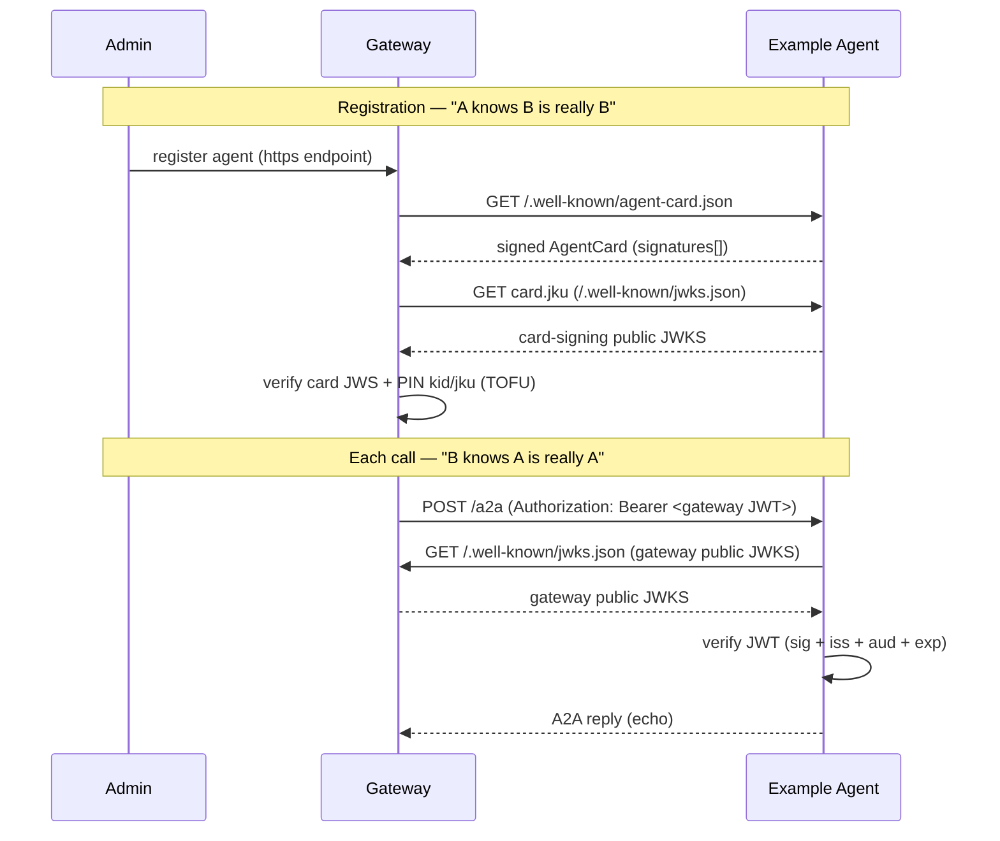

# Example Remote A2A Agent

A complete, deployable **reference custom agent** for
[looping-gateway](../README.md) Phase 7 (remote/custom A2A agents). It shows
exactly what a third party must implement to be safely registered and routed to
by the gateway — using **zero shared secrets**. All trust flows through
asymmetric Ed25519 signatures over public JWKS.

## The contract (both directions)



This agent therefore does three things:

1. **Serves a signed AgentCard** at `/.well-known/agent-card.json`. The card is
   signed with a detached-payload EdDSA flattened JWS over its **canonical JSON**
   (see [`src/canonical.ts`](src/canonical.ts)). The gateway verifies this and
   pins the signing key's `kid` + `jku` on first registration (Trust-On-First-Use).
2. **Publishes its card-signing public JWKS** at `/.well-known/jwks.json` (the
   card's `jku`), so the gateway can resolve the signing key.
3. **Verifies the gateway identity JWT** on every JSON-RPC call against the
   gateway's public JWKS (`GATEWAY_JWKS_URL`), enforcing `iss`, `aud`, and `exp`.
   The verified caller identity is read from the namespaced
   `https://looping.ai/identity` claim and echoed back.

> No secret is shared in either direction. The gateway proves it is the gateway
> with a signed JWT; this agent proves it is itself with a signed card. Each side
> only needs the other's **public** JWKS.

## Canonical JSON (must match the gateway)

The card signature is computed over a deterministic serialization:

- object keys sorted recursively (ascending),
- `JSON.stringify` with no insignificant whitespace,
- the `signatures` field excluded,
- payload bytes = UTF-8, base64url (no padding) for the JWS.

[`src/canonical.ts`](src/canonical.ts) is a byte-for-byte copy of the gateway's
`src/a2a/card-verify.ts` canonicalizer. **If you change one, change both.**

## Setup

```sh
cd example
npm install

# 1. Generate the card-signing keypair
npm run keygen example-1
#   -> copy the PRIVATE JWK into .dev.vars (CARD_SIGNING_PRIVATE_KEY)
#      and, in production, `wrangler secret put CARD_SIGNING_PRIVATE_KEY`

cp .dev.vars.example .dev.vars   # paste the private JWK

# 2. Point wrangler.jsonc vars at your deployed gateway:
#      GATEWAY_JWKS_URL  = https://<gateway>/.well-known/jwks.json
#      EXPECTED_ISSUER   = https://<gateway>            (== gateway GATEWAY_ISSUER)

npm run dev      # local
npm run deploy   # production
```

## Register it on the gateway

In a workspace admin channel, ask the admin agent to register this agent with
its **HTTPS** endpoint (the deployed worker origin). Registration fails unless:

- the endpoint is HTTPS and passes the gateway's SSRF policy,
- the AgentCard is reachable and **validly signed**,
- the signing key resolves from the card's `jku`.

Attach it to channels, then mention it with its `::name` reference.

## Environment

| Variable                   | Where          | Purpose                                                            |
| -------------------------- | -------------- | ------------------------------------------------------------------ |
| `CARD_SIGNING_PRIVATE_KEY` | secret         | Ed25519 private JWK (with `kid`) that signs the AgentCard.         |
| `GATEWAY_JWKS_URL`         | var            | Gateway public JWKS URL used to verify the gateway JWT.            |
| `EXPECTED_ISSUER`          | var            | Gateway issuer (`iss`); must equal the gateway's `GATEWAY_ISSUER`. |
| `EXPECTED_AUDIENCE`        | var (optional) | Override the expected `aud`; defaults to this worker's origin.     |

## Files

| File                                                     | Role                                                       |
| -------------------------------------------------------- | ---------------------------------------------------------- |
| [`src/index.ts`](src/index.ts)                           | Worker entry: routes card / JWKS / JSON-RPC; verifies JWT. |
| [`src/card.ts`](src/card.ts)                             | Build + sign the AgentCard; derive public JWKS.            |
| [`src/canonical.ts`](src/canonical.ts)                   | Canonical JSON contract (mirrors the gateway).             |
| [`src/verify.ts`](src/verify.ts)                         | Verify the gateway identity JWT.                           |
| [`scripts/generate-keys.mjs`](scripts/generate-keys.mjs) | Ed25519 JWK keypair generator.                             |
